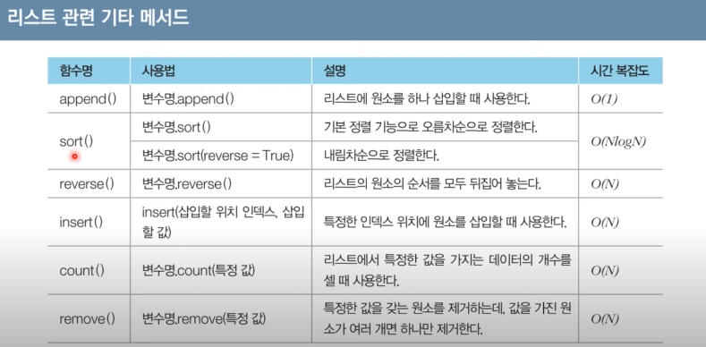

# 자료형

모든 프로그래밍은 결국 데이터를 다루는 행위   
파이썬 자료형은 정수형,실수형,복소수형,문자열,리스트,튜플,사전 등이 있다    

### 🚀정수형  
*** 
정수를 다루는 자료형   
양의 정수, 음의정수, 0이 포함

### 🚀실수형   
***
소수점 아래의 데이터를 포함하는 수 자료형   
변수에 소수점을 붙인 수를 대입하면 실수형 변수로 처리    
소수부가 0이거나 , 정수부가 0인 소수는 0을 생략하고 작성가능    
```py
a=5.
print(a) #5.0

b=-.7
print(b) #-0.7
```

### 🚀지수표현방식    
***  
파이썬에서는 e나 E를 이용한 지수표현방식을 이용 가능   
e나 E 다음에 오는 수는 10의 지수부를 의미   
  * 예를 들어 1e9라고 입력 -> 10의 9제곱(1,000,000,000)
  * 유효숫자e지수 = 유효숫자*10지수    

지수표현 방식은 임의의 큰 수를 표현하기 위해 사용    
최단경로 알고리즘에서는 도달할 수 없는 노드에 대하여 최단 거리를 무한(INF)로 설정    
(이때 가능한 최대값이 10억 미만이라면 무한(INF)의 값으로 1E9를 이용)

```py
#1,000,000,000
a= 1e9
print(a)

#752.5
a=75.25e1
print(a)

#3.954
a=3954e-3
print(a)
```
컴퓨터는 이전법을 사용하기 때문에 정확한 실수값이 나타나지 않을 수 있음   
이럴때는 **round()함수**를 이용할 수 있으며 이러한 방법이 권장됨    
예를 들어 123.456을 소수 셋째자리에서 반올림하면 round(123.456.2)라고 작성합니다 -> 결과는 123.46


### 🚀수 자료형의 연산  
*** 
사칙연산과 나머지 연산자가 많이 사용   

단, 나누기 연산자(/)를 주의하여 사용 -> 파이썬에서 나누기 연산자는 나눠진 결과를 실수형으로 반환  

다양한 로직을 설계할 때 나머지 연산자(%)를 이용 -> a가 홀수인지 체크해야하는 경우 

파이썬에서는 몫을 얻기 위해 몫 연산자(//)를 사용   

이외에도 거든제곱연사자(**)를 비롯한 다양한 연산자들이 존재   
```py
a=7
b=3

#나누기
#2.333333333335
print(a/b) 

#나머지
#1
print(a%b)

#몫
#2
print(a//b)
```
```py
a=5
b=3

#거듭제곱
#125
print(a**b)

#제곱근
#2.2360679774999979
print(a ** 0.5)
```

### 🚀리스트자료형   
*** 
여러개의 데이터를 연속적으로 담아 처리하기 위해 사용하는 자료형(배열혹은테이블이라고 부르기도함)

* **리스트초기화**   
리스트는 대괄호[]안에 원소를 넣어 초기화하며, 쉼표(,)로 원소를 구분   
비어있는 리스트를 선언하고자 할때는 list() 혹은 간단히 []를 이용   
리스트는 원소에 접근할 때는 인덱스(index)값을 괄호에 넣습니다(인덱스는 0부터 시작)   
 ```py
    # 크기가 N이고 , 모든 값이 0인 1차원 리스트 초기화
    #[0,0,0,0,0,0,0,0,0,0]
    n=10
    a=[0]*n
    print(a)
 ```

* **리스트의 인덱싱과 슬라이싱**  
인덱스 값을 엽력하여 리스트의 특정한 원소에 접근하는 것을 ->*인덱싱(indexing)*     
인덱스값은 양의 정수와 음의 정수를 모두 사용할 수 있다      
음의 정수를 넣으면 원소를 거꾸로 탐색  
 

   리스트에서 연속적인 위치를 갖는 원소들을 가져와야 할때는 *슬라이싱(slicing)*을 이용   
대괄호안에 콜론(:)을 넣어서 시작인덱스아 끝 인덱스를 설정   
끝 인덱스는 실제 인덱스보다 1을 더 크게 설정  
```py
a=[1,2,3,4,5,6,7,8,9] 

print(a[1:4])
# 두번째 원소부터 네번째 원소까지
# [2,3,4]
```

* **리스트 컴프리헨션**   
리스트를 초기화하는 방법 중 하나   
대괄호 안에 조건문과 반복문을 적용하여 리스트를 초기화   

> 0부터 9까지의 수를 포함하는 리스트
```py
array=[i for i in range(10)]
print(array)
#[0,1,2,3,4,5,6,7,8,9]
```
> 0부터 19까지의 수 중에서 홀수만 포함하는 리스트
```py
array = [i for i range(20) if i %2 ==1]
print(array)
#[1,3,5,7,9,11,13,15,17,19]
```
> 1부터 0까지의 수들의 제곱 값을 포함하는 리스트
```py
array=[i*i for i in range(1,10)]
print(array)
#[1,4,9,16,25,36,49,64,81]
```

* **리스트컴프리헨션과 일반적인 코드비교**


리스트 컴프리헨션은 **2차원 리스트를 초기화할 때 효과적으로 사용**    
특히 **N X M크기**의 2차원 리스트를 한번에 초기화 해야 할때 유용    
 > 좋은 예시) array =[[0]*m for in _range(n)]
 > 나쁜 예시) array =[[0]*m]*n -> 전체 리스트 안에 포함된 각 리스트가 모든 같은 객체로 인식

좋은예>

.png)

나쁜예>

.png)

* **언더바사용**    
파이썬에서는 반복을 수행하되 반복을 위한 변수의 값을 무시하고자 할 때 **언더바(_)**를 자주사용

코드1: 1부터 9까지의 자연수를 더하기
```py
summary=0
for i in range(1,10):
    summary+=i
print(summary)
```

코드2: "Hello World"를 5번 출력하기
```py
for _in range(5):
    print("Hello World") #따로 변수값을 지정하지 않음 
```

* **리스트 관련 다양한 메서드**


* **리스트에서 특정 값을 가지는 원소를 모두 제거하기**
```py
a =[1,2,3,4,5,5,5]
remove_set ={3,5} #집합 자료형

#remove_list에 포함되지 않은 값만을 저장
result = [i for in a if i not in remove_set]
print(result)
# [1,2,4]
```

### 🚀문자열 자료형
***
문자열 변수를 초기화할 때는 큰따옴표("")나 작은따옴표('')를 이용
문자열 안에 큰따옴표나 작은따옴표가 포함되어야 하는 경우가 있다    
  >전체 문자열을 큰 따옴표로 구성하는 경우, 내부적으로 작은따옴표를 포함      
  >전체 문자열을 작은 따옴표로 구성하는 경우, 내부적으로 큰따옴표를 포함   
  >혹은 백슬래시(\)를 사용하면, 큰따옴표니 작은따옴표를 원하는 만큼 포함    

* 문자열 연산   
문자열 변수에 덧셈(+)을 이용하면 문자열이 더해져서 연결(concatenate)   
문자열 변수를 특정한 양의 정수와 곱하는 경우, 그 문자열이 그 값만큼 여러번 더해짐   
인덱싱과 슬라이싱 이용가능(단, 특정인덱스 값은 변경 불가능)   

### 🚀튜플 자료형
***
**리스트와 유사하지만 차이가 있음**
 * 튜플은 한 번 선언된 값을 변경할 수 없다
 * 리스트는 대괄호[]를 이용하지만 , 퓨플은 소괄호()를 이용
 * 튜플은 리스트에 비해 상대적으로 공간 효율적

**튜플을 사용하면 좋은경우**
* 서로 다른 성질의 데이터를 묶어서 관리할 때
    + 최단경로 알고리즘에서는 (비용,노드번호)의 형태로 자주사용

* 데이터의 나열을 해싱(Hashing)의 키 값으로 사용할 때
    + 튜플은 변경이 불가능하므로 리스트와 다르게 키 값으로 사용
* 리스트보다 메모리를 효율적으로 사용해야할때 


### 🚀사전자료형
***
**키(key)와 값(value)의 쌍으로 데이터로 가지는 자료형**      
 > 앞서 다루었던 리스트나 튜플이 값을 순차적으로 저장하는 것과는 대비 

원하는 '변경 불가능한(Immutable) 자료형'을 키로 사용 

파이썬의 사전 자료형은 해시 테이블을 이용하므로 데이터 조회 및 수정에 있어서 0(1)의 시간에 처리

```py
data =dict() #dict()함수를 통해 사전자료형 초기화
data['사과'] ='Apple'
data['바나나'] ='Banana'
data['코코넛'] ='Coconut'

print(data) # {'사과': 'Apple','바나나': 'Banana' ,'코코넛': 'Coconut'}

if '사과' in data:
    print("'사과'를 키로 가지는 데이터가 존재") #키값 존재확인
```
키와 값을 별도로 뽑아내기 위한 메서드를 지원   
 >키 데이터만 뽑아서 리스트로 이용할 때는 keys()함수를 이용
 >값 데이터만 뽑아서 리스트로 이용할 때는 values()함수를 이용


### 🚀집합 자료형
***
* 집합의 특징
    * 중복을 허용하지 않는다
    * 순서가 없다
* 집합은 리스트 혹은 문자열을 이용하여 초기화
    * 이때 **set()함수**를 이용
* 중괄호{}안에 각 원소를 콤마(,)를 기준으로 구분하여 삽입함으로 초기화
* 데이터의 조회 및 수정에 있어서 0(1)의 시간에 처리

    집합 자료형 초기화방법
```py
data=set([1,1,2,3,4,4,5])
print(data)
#{1,2,3,4,5}

data={1,1,2,3,4,4,5}
print(data)
#{1,2,3,4,5}
``` 

* 기본적인 집합 연산으로는 합집합, 교집합, 차집합 연산 등
  + 합집합: 집합A에 속하거나 B에 속하는 원소로 이루어진 집합(A ⋃ B) 
  + 교집합: 집합A에도 속하고 B에도 속하는 원소로 이루어진 집합(A ⋂ B) 
  + 차집합: 집합A의 원소 중에서 B에 속하지 않는 원소들로 이루어진 집합(A - B)

<br/>

🌟🌟**사전자료형과 집합자료형의 특징**   
* 리스트나 튜플은 순서가 있기 때문에 인덱싱을 통해 자료형의 값을 얻을 수 있다   
* 사전자료형과 집합 자료형은 *순서가 없기 때문에* 인덱싱으로 값을 얻을 수 없다   
    * 사전에 키(KEY)혹은 집합의 원소를 이용해 0(1)의 시간복잡도로 조회

# 기본입출력

모든프로그램은 약속된 입출력양식이 있다
프로그램 동작의 첫 단계는 데이터를 입력 받거나 생성하는 것 

* 🚀가장 많이 사용되는 표준입출력 방법
    * input() 함수는 한줄의 문자열을 입력 받는 함수
    * map() 함수는 리스트의 모든 원소에 각각 특정한 함수를 적용
      * 예시) 공백을 기준으로 구분된 데이터를 입력받을때는 다음과 같이 사용
      + list(map(int,int().split()))      

      * 예시) 공백을 기준으로 구분된 데이터의 개수가 많지 않다면,    
      + a,b,c =map(int,int().split()) 

      ```py
      n=int(input()) #데이터 개수 입력: 5
      data=list(map(int,input().split())) #65,90,75,34,99

      data.sort(reverse=True)
      print(data) #[99,90,75,65,34]
      ```
* 🚀n,m,k를 공백을 시준으로 구분하여 입력      
      ```py
      n, m, k =map(int,input().split()) #3 5 7
      print(n, m, k) #3 5 7
      ```

* 🚀빠르게 입력받기
    * 사용자로부터 입력을 최대한 빠르게 받아야 하는 경우   
    * 파이썬의 경우 sys라이브러리에 정의되어 있는 sys,stdin,readline()메서드 이용   
      단, 입력 후 엔터가 줄바꿈 기호로 입력되므로 *rstrip( )메서드*를 함께 호출
      ```py
      import sys

      #문자열 입력받기
      data=sys.stdin.readline().rstrip()
      print(data)
      ```

* 🚀자주 사용되는 표준 출력방법
    * 기본 출력은 print()함수이용   
        각 변수를 콤마(,)를 띄어쓰기로 구분하여 출력
    * print()는 기본적으로 출력 이후에 줄 바꿈을 수행   
        줄바꿈을 원치 않을 경우 'end'속성을 이용

# 조건문과 반복문

### 🚀조건문
***
프로그램의 흐름을 제어하는 문법    

조건문을 이용해 조건에 따라서 프로그램의 로직을 설정   

파이썬에서는 코드의 블록(Block)을 들여쓰기로 지정   
(4개의 공백문자를 사용하는 것을 표준으로 설정)    

조건문의 기본적인 형태는 if~elif~else    


    


